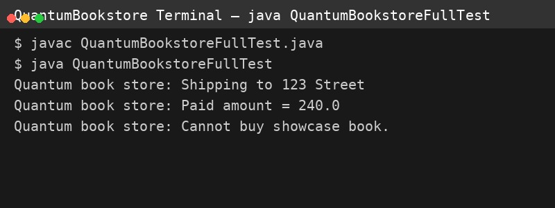

# Quantum Bookstore

This is a simple object-oriented implementation of an online bookstore system for the Fawry N² Dev Slope challenge.

## Features

- Supports different types of books: PaperBook, EBook, ShowcaseBook
- Add books to inventory
- Remove outdated books (based on publication year)
- Buy books (handles inventory, returns price, and triggers services)
- Designed to be extensible for future book types

## Structure

- `Book` (abstract base class)
- `PaperBook`, `EBook`, `ShowcaseBook` (concrete implementations)
- `Inventory` for book management
- `QuantumBookstore` for core logic
- `ShippingService` and `MailService` (stubs)
- `QuantumBookstoreFullTest` (demo usage)

## Run the test

To run the test, compile and run the `QuantumBookstoreFullTest` class.

## Example Output

